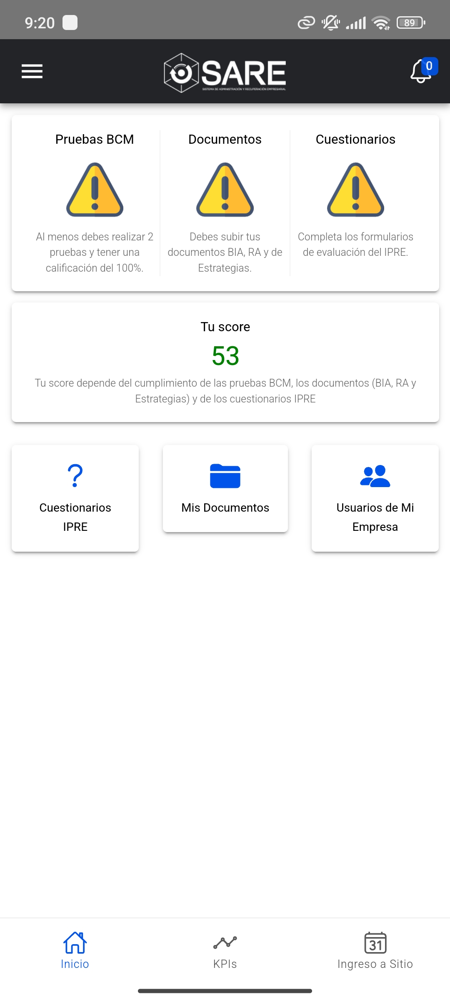
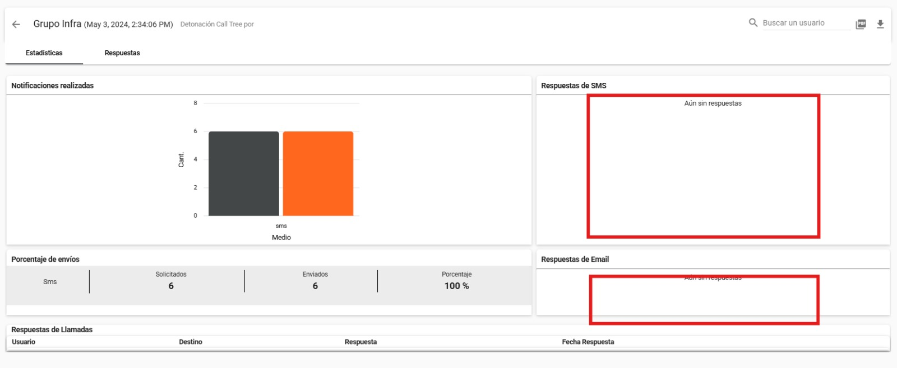
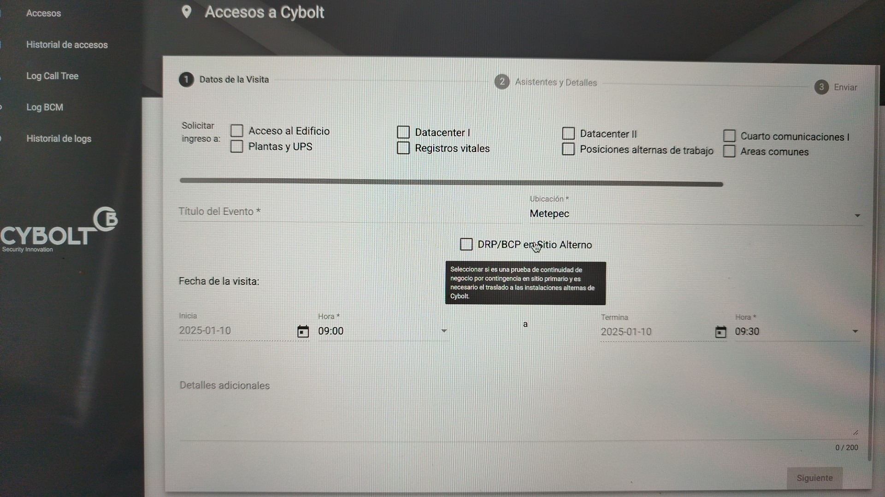
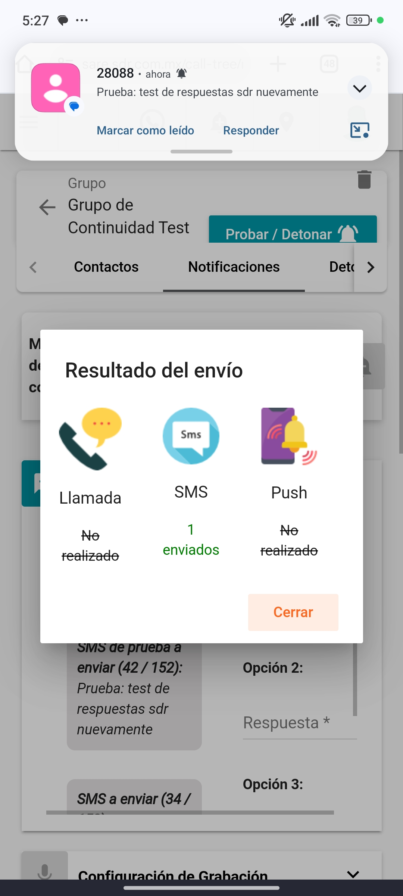
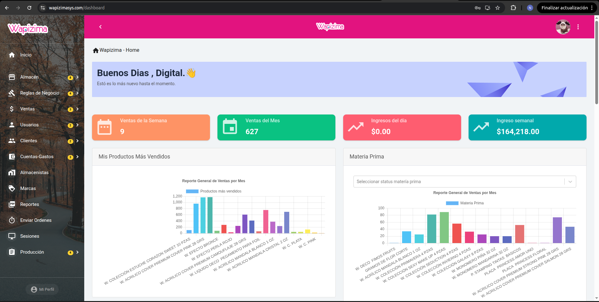
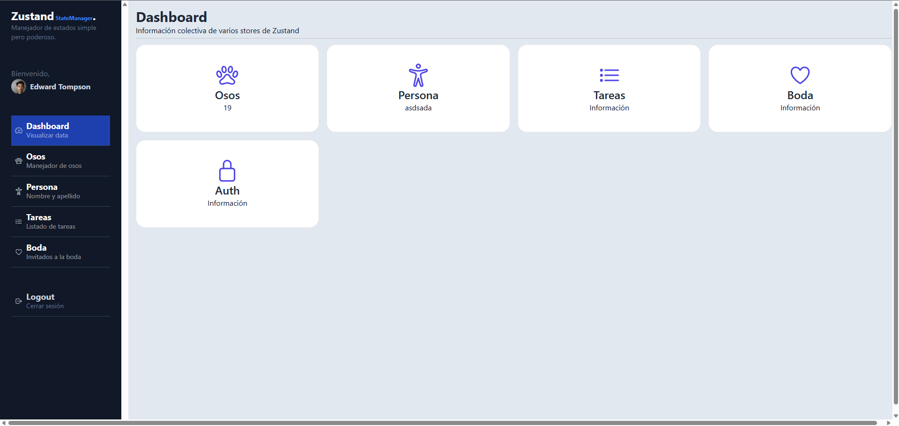

## 1Rocket Laps
### Abby App — Aplicación móvil interna

> App interna desarrollada como alternativa a la plataforma oficial [Abby](https://www.abby.mx/sign-in), replicando sus funciones principales: registro de asistencia, documentos, posts, noticias, solicitud de vacaciones y justificantes, consulta de nómina, y próximos cumpleaños/aniversarios.

**Contribución:**
 
- Desarrollé la aplicación desde cero de forma autónoma, gestionando arquitectura e implementación con comunicación directa al cliente para reportar avances y tomar decisiones técnicas.
- Colaboré con el equipo de diseño para reemplazar el splash screen basado en imágenes/GIFs/videos (que generaban problemas de rendimiento y controles no deseados en iOS) por **animaciones Lottie**, logrando carga más fluida, mejor rendimiento y experiencia consistente en Android e iOS.

**Capturas de pantalla:**
 

> **Nota:** Las capturas reflejan un nombre distinto porque el acceso fue modificado temporalmente para fines de desarrollo.

---

### SARE — Plataforma de monitoreo y seguridad

> Sistema de monitoreo de KPIs con control de accesos en instalaciones y respuesta ante emergencias. Alerta y notifica en tiempo real mediante SMS, email, push notifications y mensajes de voz.

**Stack:** App móvil · Frontend · Backend
 

**Contribución:**
 
- Actualicé la aplicación (pendiente de aprobación por parte del cliente).
- Migré el servicio de SMS de la solución anterior a **BroadcasterMobile** por demoras notificadas.
- Añadí métricas, desarrollé módulos y di soporte técnico bajo metodología **Scrum**.

**Capturas de pantalla:**

## Digital Pineapple
> **Nota:** Actualmente algunos servicios no están activos. Desconozco la situación interna de la empresa y su relación con sus clientes.

### YoComparto — Aplicación móvil 
> Aplicacion para el registro de citas para la renta / compra de inmuebles hasta el proceso de aprobación en Google Play.

**Contribucione:**
 
- Implementé componentes, navegación y diseño de interfaz hasta completar el proceso de publicación en Google Play.

**Evidencia de commits:**
 

### Wapizimasys
> Sistema de control de inventario de productos de belleza , gestion de ventas con integracion de facturacion manejo de de ordenes de produccion de producto.

**Stack:** Frontend · Backend

**Contribución:**
 
- Dirigi el impacto y cambios correspondientes a nivel de codigo para actulizar la facturacion 3.3 a 4.0
- Desarrolle multiples modulos como (Marcas , Categorias , Sucategorias , Ordenes de Prouduccion , Trabajadores, Raiking de ventas ) todo partiende modelo entidad relacion

## 📚 Cursos y Aprendizaje Personal
| Proyecto | Tecnología | Descripción |
|---|---|---|
| Calculadora | React Native | App de calculadora móvil |
| PelisApp | React Native | Aplicación de catálogo de películas |
| Zustand Demo | React + Vite + Zustand | Gestión de estado global |
| Microservicios | NestJS + Kubernetes | Arquitectura distribuida con múltiples servicios |

  
