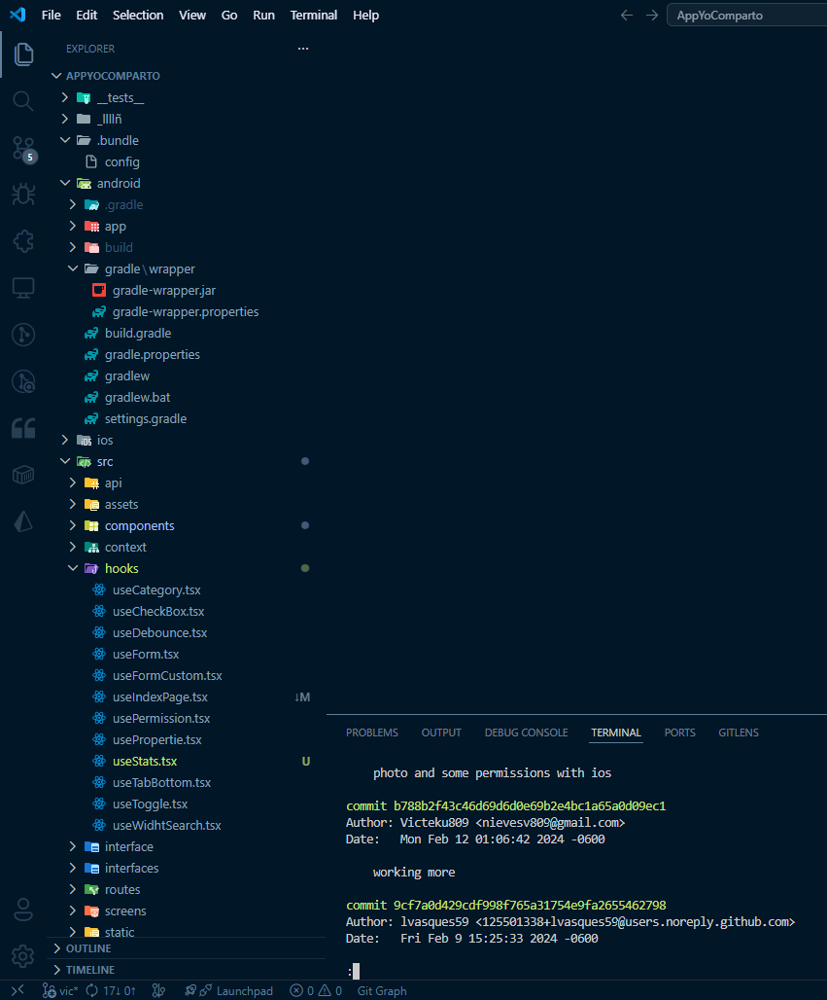

### 1Rocket Laps

<table>
	<tr colspan="2">
		<th> Abby App</th>
        <th>Project Evidence</th>
	</tr>
	<tr>
		<th rowspan="5">
            
        </th>
	</tr>
	<tr >
		<td width="80%">
			<ul>
            	<li>Desarrollé la aplicación desde cero, gestionando de forma autónoma tanto la arquitectura como la implementación. Mantuve comunicación directa para reportar avances, lo que me permitió tomar decisiones técnicas y optimizar el desarrollo de manera eficiente.</li> 
				<li>Trabajé en conjunto con el equipo de diseño para implementar una animación de splash screen usando Lottie. Inicialmente se utilizaban imágenes, GIFs o videos, lo que generaba problemas de rendimiento y, en iOS, mostraba controles de reproducción no deseados.
                Tras investigar alternativas, propuse e integré Lottie en Android e iOS, logrando una carga más fluida, mejor rendimiento y una experiencia de usuario más consistente.
                </li>            
			</ul>
		</td>
	</tr>
    <tr>
       <td>
            
            
            
            
            
            
            
            
            
        </td>
    </tr>
</table>

> **Nota:** Las capturas reflejan un nombre distinto debido a que el acceso fue modificado temporalmente para fines de desarrollo.

### Digital Pineapple

<table>
	<tr colspan="2">
		<th>Digital Pineapple - YoComparto</th>
        <th>Project Evidence</th>
	</tr>
	<tr>
		<th rowspan="5">
            
        </th>
	</tr>
	<tr >
		<td width="80%">
			<ul>
            	<li>Desarrollé la aplicación hasta su proceso de aprobación en Google Play, encargándome de la implementación de componentes, navegación y diseño de la interfaz.</li>           
			</ul>
		</td>
	</tr>
    <tr>
       <td>
            
        </td>
    </tr>
</table>